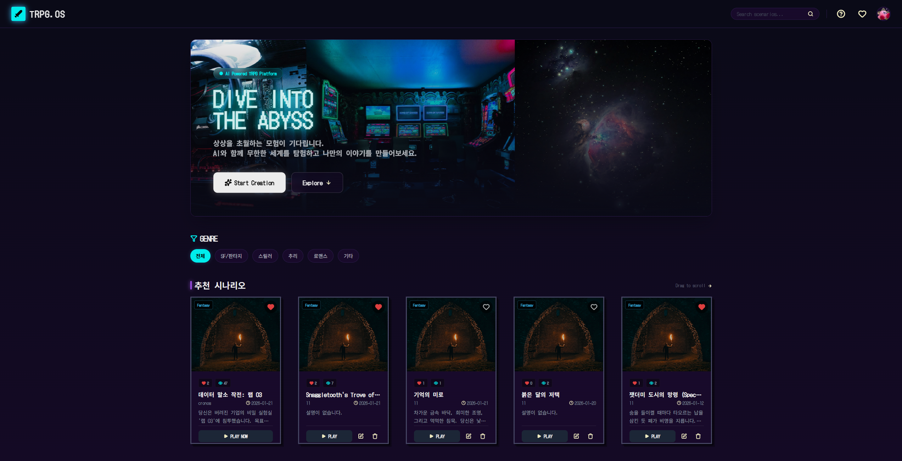
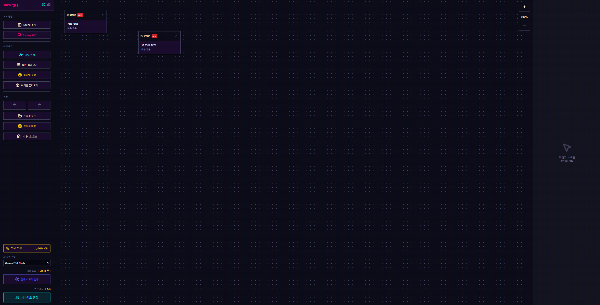

# 🎲 YEOUL (여울): AI 기반 TRPG 시나리오 제작 및 플레이 플랫폼


> **"단순 챗봇을 넘어 RAG 및 Vector DB, 다중 에이전트를 활용한 몰입형 인터랙티브 AI 게임 엔진 구축 경험"**

<br>

## 📌 1. 프로젝트 소개 (Project Overview)
**YEOUL (여울)**은 사용자가 프롬프트나 복잡한 설정 없이도 AI와 함께 고품질의 TRPG(Tabletop Role-Playing Game) 시나리오를 창작하고, 생성된 세계관 속에서 실시간으로 게임을 플레이할 수 있는 풀스택 웹 플랫폼입니다.

게임이 진행됨에 따라 누적되는 방대한 대화 기록과 세계관 설정을 AI가 잊지 않도록 **Vector DB 기반의 RAG(검색 증강 생성) 아키텍처**를 도입하였으며, **Redis를 활용한 실시간 상태(State) 관리**를 통해 대기 시간 없는 매끄러운 게임 경험을 구현했습니다.

<br>

## 🚀 2. 주요 기능 (Key Features)
- **🧠 지능형 시나리오 빌더:** 장르, 키워드 입력만으로 메인 퀘스트, 세계관, 초기 맵 구조 자동 생성.
- **🎲 인터랙티브 플레이 엔진:** 플레이어의 선택에 따라 결말과 세계관이 유동적으로 변하는 AI GM 시스템.
- **🗺️ Mermaid 기반 동적 맵/관계도:** 게임 진행에 따라 변화하는 NPC 관계 및 지도 시각화.
- **👥 NPC 및 이미지 자동 생성:** 프롬프트 엔지니어링을 통한 캐릭터 성격 부여 및 S3 기반 이미지 저장.

<br>

## 🛠️ 3. 기술 스택 (Tech Stack)
### **Backend & Architecture**
- **Language:** Python
- **Framework:** Flask, SQLAlchemy
- **Data & State:** PostgreSQL, Redis, Vector DB (Chroma/FAISS)
- **Cloud & Deploy:** AWS S3 (이미지 스토리지), Railway (CI/CD 배포)

### **AI / ML**
- **LLM:** Google Gemini Pro API
- **Architecture:** RAG (Retrieval-Augmented Generation), Multi-Agent

### **Frontend**
- HTML5, CSS3, JavaScript (ES6+)
- **Visualization:** Mermaid.js (관계도 렌더링)

<br>

## 📁 4. 프로젝트 구조 (Directory Structure)
```text
📦 TRPG-YEOUL
 ┣ 📂 core/              # Redis, Vector DB, S3 등 시스템 코어 및 상태 관리 모듈
 ┣ 📂 routes/            # Flask 블루프린트 라우팅 (api, auth, game, views)
 ┣ 📂 services/          # 다중 AI 에이전트 서비스 (NPC, 챗봇, 맵 생성, 시나리오 빌더)
 ┣ 📂 DB/                # 시나리오 및 프리셋 JSON 데이터베이스
 ┣ 📂 templates/         # 웹 페이지 HTML (빌더, 플레이어 뷰 등)
 ┣ 📂 static/            # JS 모듈 및 CSS 리소스
 ┣ 📜 app.py             # Flask 애플리케이션 진입점 (Entry Point)
 ┣ 📜 railway.json       # Railway 클라우드 배포 설정 파일
 ┗ 📜 README.md

```

<br>

## 💻 8. 실행 방법 (How to Run)
```python
# 1. 저장소 클론
git clone [https://github.com/jinwoong21/-AI-Scenario-Platform---YEOUL.git](https://github.com/jinwoong21/-AI-Scenario-Platform---YEOUL.git)
cd -AI-Scenario-Platform---YEOUL

# 2. 환경 변수 설정
# .env.example을 복사하여 .env 생성 후 API Key 및 DB URL 입력
cp .env.example .env

# 3. 필요 라이브러리 설치
pip install -r requirements.txt

# 4. 데이터베이스 마이그레이션 및 초기화
python init_db.py

# 5. 서버 실행
python app.py
```
<br>

## 💻 6. 핵심 아키텍처 및 코드 설명 (Core Logic)

### 💡 [1] RAG 및 Vector DB를 활용한 장기 기억(Long-term Memory) 구현
TRPG 특성상 대화가 길어지면 LLM이 과거의 사건이나 NPC를 잊어버리는 한계가 있습니다. 이를 극복하기 위해 사용자의 모든 행동과 세계관 데이터를 `core/vector_db.py`를 통해 벡터화하여 저장하고, 매 턴마다 연관된 컨텍스트만 추출하여 프롬프트에 주입합니다.
```python
# core/vector_db.py (아키텍처 핵심 구조)
def retrieve_relevant_lore(query, scenario_id):
    """현재 사용자의 행동(query)과 가장 연관성이 높은 과거 사건이나 세계관 설정을 Vector DB에서 검색하여 반환합니다."""
    vector_store = get_vector_store(scenario_id)
    relevant_docs = vector_store.similarity_search(query, k=3)
    return build_context_from_docs(relevant_docs)
```
### 💡 [2] 역할이 분리된 다중 AI 에이전트 (Multi-Agent System)
LLM의 성능을 극대화하기 위해 하나의 거대한 프롬프트를 쓰지 않고, services/ 모듈 하위에 역할별 에이전트를 완벽히 분리했습니다.
```python
# services/ 모듈 구조화
from .builder_agent import generate_world_state
from .npc_service import create_dynamic_npc
from .mermaid_service import generate_relation_map

def process_game_turn(player_action):
    """플레이어의 턴이 진행될 때, 메인 게임 엔진이 각 에이전트를 호출하여 세계관을 업데이트하고 시각화 맵을 재생성합니다."""
    # 1. AI GM의 반응 생성 (Chatbot Service)
    # 2. 새로운 인물 등장 시 NPC 자동 생성 (NPC Service)
    # 3. 인물 관계도(Mermaid) 실시간 업데이트 (Mermaid Service)
```

### 💡 [3] Redis 기반 실시간 세션 및 상태 관리
매 턴마다 무거운 관계형 DB(PostgreSQL)에 접근하는 병목을 막기 위해, core/redis_client.py 및 core/state.py를 구축하여 현재 진행 중인 게임의 상태(월드 스테이트, 인벤토리 등)를 Redis 메모리 캐시에 올려 빠른 응답 속도(Latency)를 확보했습니다.

<br>

## 📸 7. 서비스 시연 화면 (Screenshots)

사용자가 자신만의 세계관을 구축하고, AI 게임 마스터(GM)와 함께 TRPG를 플레이할 수 있는 몰입감 높은 UI를 제공합니다.

| 📊 메인 대시보드 및 분류 화면 |                     💬 AI 게임 마스터와의 플레이                     | 📝 AI 시나리오 제작 |
|:----------------------------------------------------------------:|:----------------------------------------------------------:|:-------------------------------------------------------------------:|
|  |  |  |
